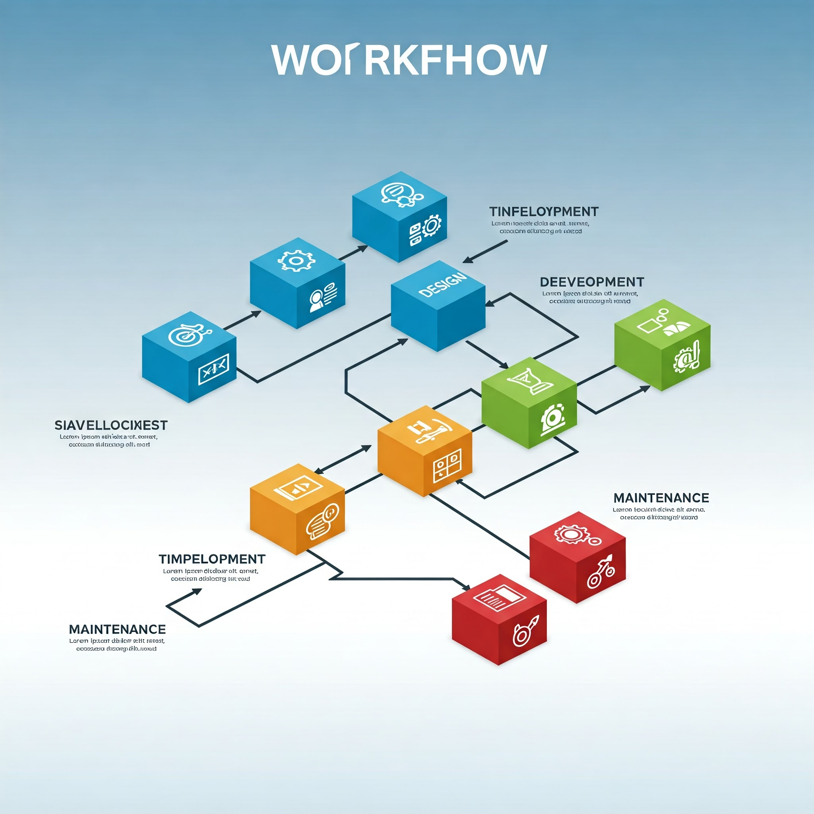

# Introduction

L'automatisation est devenue un outil essentiel pour gagner du temps et améliorer l'efficacité dans de nombreux domaines. Dans cet article, nous allons explorer les bases de **Make** et **n8n**, deux outils puissants pour automatiser vos tâches quotidiennes.

## Pourquoi utiliser Make et n8n ?

Voici quelques raisons pour lesquelles ces outils sont populaires :

1.  **Facilité d'utilisation** : Une interface visuelle intuitive pour créer des flux de travail.
2.  **Flexibilité** : Compatible avec de nombreuses applications et API.
3.  **Économie de temps** : Automatisez les tâches répétitives pour vous concentrer sur ce qui compte vraiment.

## Étape 1 : Comprendre les bases

### Qu'est-ce que Make ?

Make (anciennement Integromat) est une plateforme d'automatisation qui vous permet de connecter différentes applications et services pour créer des flux de travail automatisés.

### Qu'est-ce que n8n ?

n8n est une plateforme d'automatisation open-source qui offre une grande flexibilité pour créer des flux de travail complexes.

## Étape 2 : Exemple de cas d'utilisation

### Automatiser l'envoi d'e-mails

Avec Make ou n8n, vous pouvez automatiser l'envoi d'e-mails en fonction de certains déclencheurs, comme :

- La réception d'un formulaire.
- Une mise à jour dans une base de données.
- Un événement spécifique dans une application.

### Exemple de flux de travail

1.  **Déclencheur** : Un formulaire est soumis sur votre site web.
2.  **Action 1** : Les données sont enregistrées dans Google Sheets.
3.  **Action 2** : Un e-mail de confirmation est envoyé à l'utilisateur.

## Étape 3 : Ressources utiles

- [Documentation officielle de Make](https://www.make.com/)
- [Documentation officielle de n8n](https://n8n.io/)
- [Tutoriels vidéo sur YouTube](https://www.youtube.com/)

## Conclusion

Make et n8n sont des outils incroyablement puissants pour automatiser vos tâches. Que vous soyez un débutant ou un utilisateur avancé, ces plateformes peuvent vous aider à gagner du temps et à améliorer votre productivité.

### Citation inspirante

> "L'automatisation n'est pas seulement un gain de temps, c'est une opportunité de se concentrer sur ce qui compte vraiment." – Lucas Zubiarrain
